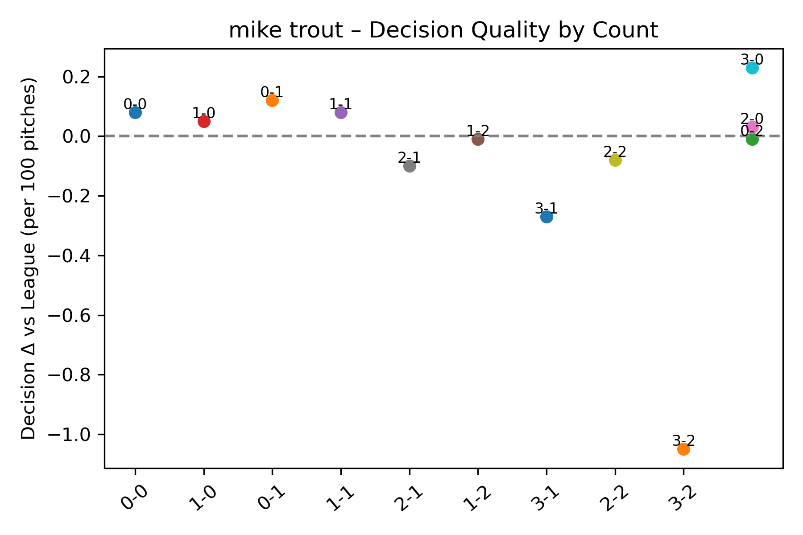

# MLB Swing Decision Analysis

**Purpose & Motivation**
Every hitter faces a constant trade-off: swing at a borderline pitch or take the chance to work a better count? Our **Swing Decision Model** quantifies that choice by learning from three seasons of Statcast data (2022–2024) — producing a `decision_value` score that measures how good or bad a player’s swing decision is in each balls–strikes count. This empowers analysts and coaches to:

* **Compare hitters** on an apples-to-apples basis: Who makes the best decisions in 0–2, 3–1, etc.?
* **Identify count-specific strengths and weaknesses**, tailoring practice plans or in-game coaching.
* **Extend to high-leverage contexts** (late innings, close scores, runners in scoring position) to uncover clutch performance.

---

## Table of Contents

1. [Project Structure](#project-structure)
2. [Getting Started](#getting-started)
3. [Data](#data)
4. [Methodology](#methodology)
5. [Pipeline & Scripts](#pipeline--scripts)
6. [Interactive Notebook](#interactive-notebook)
7. [Usage Examples](#usage-examples)
8. [Outputs](#outputs)
9. [Requirements](#requirements)
10. [Future Work](#future-work)

---

## Project Structure

```
SWING_DECISION_MODEL/
├─ data/
│  ├ raw/
│  │  ├ statcast_2022_2024.csv        # Raw pitch data
│  │  └ run_expectancy.csv            # Base–out run expectancy lookup
│  └ processed/
│     ├ statcast_preprocessed.csv     # Cleaned Statcast data (post-preprocessing)
│     └ statcast_features.csv         # Model-ready features with `decision_value`
├─ models/
│  └ xgb_pipeline.joblib              # Saved preprocessing & feature pipeline
├─ notebook/
│  └ Swing_Decision_Analysis.ipynb    # Interactive end-to-end Jupyter Notebook
├─ outputs/
│  ├ feature_importance.png           # Top-20 feature importances
│  ├ shap_summary.png                 # Shap Summary
│  ├ top10.csv / bottom10.csv         # League leaderboards by `decision_value`
│  └ {PlayerName}.png                 # Per-player decision-quality plots
├─ src/
│  ├ data_preprocessing.py            # Clean raw data & filter outliers
│  ├ data_loading.py                  # Fetch or update raw Statcast data
│  ├ feature_engineering.py           # Assemble features & compute `decision_value`
│  ├ train_model.py                   # Train & serialize model & pipeline
│  ├ evaluate.py                      # Plot feature importances & metrics
│  ├ leaderboard.py                   # Generate top/bottom leaderboards
│  └ player_analysis.py               # CLI for single-player analysis & plots
├─ requirements.txt                   # Python dependencies
└─ README.md                          # This file
```

---

## Getting Started

### Prerequisites

* Python 3.8+
* Git

### Installation

```bash
git clone https://github.com/borsheng/SWING_DECISION_MODEL.git
cd SWING_DECISION_MODEL
python3 -m venv .venv
source .venv/bin/activate        # macOS/Linux
pip install -r requirements.txt
```

---

## Data

### Raw Data

* **data/raw/statcast\_2022\_2024.csv**
  Comprehensive pitch-by-pitch Statcast data for 2022–2024 seasons.

* **data/raw/run\_expectancy.csv**
  Empirical run-expectancy table mapping each base/out state (`base_state`) to expected runs scored.

### Processed Data

* **data/processed/statcast\_preprocessed.csv**
  Output of `src/data_preprocessing.py`: cleaned dataset with:

  * Selected tracking & context columns
  * Missing values in critical metrics dropped or imputed by group means (pitcher, season, pitch\_type)
  * Domain-based outlier filters (e.g., release\_speed, spin\_rate, plate\_x/z limits)
  * Deduplicated rows

* **data/processed/statcast\_features.csv**
  Output of `src/feature_engineering.py`: combines preprocessed pitches with:

  * Contextual features (balls, strikes, runners\_on, outs\_when\_up, score\_diff)
  * Pre-swing run expectancy (`pre_run_exp`) lookup
  * New engineered metrics (e.g., movement differentials, lag features)
  * Computed label **`decision_value`** = (post-swing run value) – (`pre_run_exp`)

---

## Methodology

The overall pipeline for the Swing Decision Model comprises four key phases:

1. **Data Preprocessing**

   * **Column Selection**: Retain only columns necessary for analysis (tracking, count, base/out).
   * **Missing Data**: Drop rows with missing critical fields (release metrics) and fill other gaps using group-level means.
   * **Outlier Filtering**: Apply domain knowledge filters on release speed (60–110 mph), extension (3–8 ft), spin\_rate (1500–3500 rpm), and plate coordinates (−2.5 ft ≤ plate\_x ≤ 2.5 ft, 0 ft ≤ plate\_z ≤ 6 ft).
   * **Deduplication**: Remove duplicate records to ensure data integrity.
   * **Output**: `data/processed/statcast_preprocessed.csv`.

2. **Feature Engineering & Label Construction**

   * **Run Expectancy Join**: Merged with `run_expectancy.csv` to obtain **`pre_run_exp`** for each base/out state.
   * **Context Features**: Used raw `balls`, `strikes`, and `outs_when_up`, and recomputed `runners_on` and `score_diff` from base/out and score columns.
   * **Engineered Metrics**: Retained original tracking features (`release_speed`, `plate_x`, `plate_z`, `pfx_x`, `pfx_z`, etc.) and added lag-based features (`prev_event`, `is_strike`, `strike_streak`).
   * **Label – `decision_value`**: Computed via the `outcome_value` mapping of post-contact events (e.g., hit, ball, strike), without subtracting `pre_run_exp`.
   * **Output**: `data/processed/statcast_features.csv`.

3. **Model Training & Validation**

   * **Model Benchmarking**: Compared two regressors — Ridge and XGBoost — using the same preprocessing pipeline.  
   * **Pipeline**: Use `ColumnTransformer` to scale numeric features and one-hot encode categorical ones; employ XGBoost regressor with early stopping on a validation fold.
   * **Hyperparameters**: Tune via cross-validation (learning rate, max\_depth, n\_estimators).
   * **Validation**: Utilize GroupKFold (grouped by batter) to preserve at-bat contexts.
   * **Metrics**: Evaluate using MAE, RMSE, and R² to gauge prediction accuracy.

4. **Interpretation & Analysis**

   * **Feature Importances**: Extract top drivers from XGBoost (`feature_importance.png`) and complement with SHAP analysis.
   * **Leaderboards**: Compute average `decision_value` per batter (players with ≥1,000 pitches) to produce `top10.csv` and `bottom10.csv`.
   * **Single-Player Analysis**: Via CLI (`player_analysis.py`), generate count-specific decision plots comparing a hitter to league averages.

---

## Pipeline & Scripts

1. **Data Preprocessing**

   ```bash
   python src/data_preprocessing.py
   ```

   Cleans raw data and generates `data/processed/statcast_preprocessed.csv`.

2. **Feature Engineering**

   ```bash
   python src/feature_engineering.py
   ```

   Produces `data/processed/statcast_features.csv` with features and `decision_value`.

3. **Model Training**

   ```bash
   python src/train_model.py
   ```
 
   * Utilize GroupKFold (grouped by batter) validation
   * Trains XGBoost pipeline
   * Saves `models/xgb_pipeline.joblib`.

4. **Feature Importance & Evaluation**

   ```bash
   python src/evaluate.py
   ```

   Generates `outputs/feature_importance.png` and `outputs/shap_summary.png`.

5. **Leaderboard Generation**

   ```bash
   python src/leaderboard.py
   ```

   Filters for batters with ≥1,000 pitches, then outputs `outputs/top10.csv` & `outputs/bottom10.csv`.

6. **Single-Player CLI Analysis**

   ```bash
   python src/player_analysis.py --name "Mike Trout"
   ```

   Produces per-count decision plots (`outputs/Mike_Trout.png`).


---

## Usage Examples

```bash
# Full pipeline
python src/data_preprocessing.py
python src/feature_engineering.py
python src/train_model.py
python src/evaluate.py
python src/leaderboard.py

# Single-player analysis
python src/player_analysis.py --name "Mike Trout"
```

---

## Outputs

* **outputs/feature\_importance.png** – Top 20 feature importances.
* **outputs/shap\_summary.png** – Shap summary.
* **outputs/top10.csv, outputs/bottom10.csv** – League leaderboards by decision quality.
   ##### Top 10 Batters by Average Decision Value

   | Rank | Batter Name       | Mean Decision Value |
   |:----:|:------------------|:-------------------:|
   | 1    | luis arráez       | 3.82                |
   | 2    | jeff mcneil       | 3.47                |
   | 3    | josé ramírez      | 3.28                |
   | 4    | alec burleson     | 3.24                |
   | 5    | nick madrigal     | 3.20                |
   | 6    | freddie freeman   | 3.18                |
   | 7    | jackson merrill   | 3.15                |
   | 8    | andrew benintendi | 3.11                |
   | 9    | tony kemp         | 3.10                |
   | 10   | alex bregman      | 3.09                |

   ##### Bottom 10 Batters by Average Decision Value

   | Rank | Batter Name            | Mean Decision Value |
   |:----:|:-----------------------|:-------------------:|
   | 1    | josé siri              | –0.10               |
   | 2    | avisaíl garcía         | –0.09               |
   | 3    | nick pratto            | 0.02                |
   | 4    | franmil reyes          | 0.16                |
   | 5    | elehuris montero       | 0.17                |
   | 6    | christian bethancourt  | 0.24                |
   | 7    | javier báez            | 0.29                |
   | 8    | mickey moniak          | 0.34                |
   | 9    | jake burger            | 0.46                |
   | 10   | luke raley             | 0.49                |

* **outputs/{PlayerName}.png** – Decision-value plots across counts for individual hitters.

---

## Requirements

Key dependencies listed in `requirements.txt`:

* pandas, numpy
* scikit-learn
* xgboost
* matplotlib
* pybaseball

---

## Future Work

* **Interactive Web App**: Deploy via Streamlit or Flask for real-time input of player/count and visualization.
* **CI/CD Pipeline**: Automate data ingestion, retraining, and deployment using GitHub Actions or Airflow.
* **High-Leverage Analysis**: Extend model to evaluate swing decisions in playoff games, late innings, and pressure situations.

---
