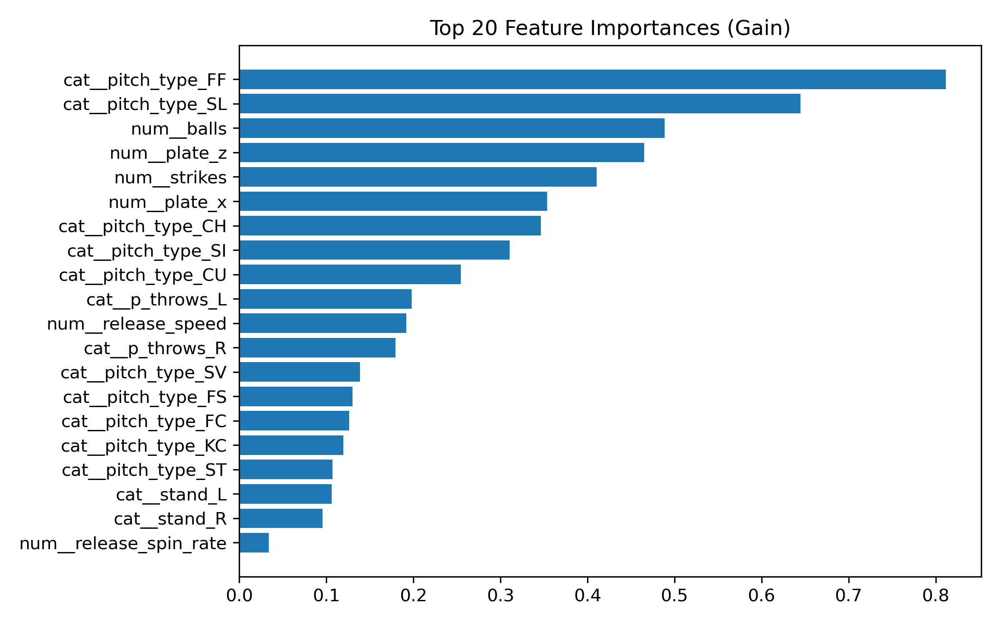

# MLB Swing Decision Model (2022‑24)

> *“Should I swing or should I take?”*  
> This repository answers that question with one number: **decision advantage (runs / 100 pitches).**

Unlike most hitting models, we **ignore contact results** and focus on the *choice itself*.  
By comparing the expected value of swinging vs taking for every pitch location and count, we quantify how many runs a hitter gains (or forfeits) purely through swing decisions. Aaron Judge’s legendary power can still rank low if his swing decisions, on average, leave runs on the table.

---

## Table of Contents
1. [Project Structure](#project-structure)  
2. [Quick Start](#quick-start)  
3. [Data](#data)  
4. [Methodology](#methodology)  
5. [Pipeline Scripts](#pipeline-scripts)  
6. [Outputs](#outputs)  
7. [Why It Matters](#why-it-matters)  
8. [Requirements](#requirements)  
9. [Future Work](#future-work)  

---

## Project Structure
```

SWING\_DECISION\_MODEL/
├ data/
│  ├ raw/
│  │  ├ statcast\_2022\_2024.csv       # raw Statcast pitches
│  │  └ run\_expectancy.csv            # RE‑24 base–out table
│  └ processed/
│     ├ statcast\_preprocessed.csv     # cleaned pitches
│     └ statcast\_features.csv         # features + decision\_delta
├ models/
│  └ xgb\_decision.joblib              # ColumnTransformer + XGBRegressor
├ outputs/
│  ├ feature\_importance.png
│  ├ shap\_summary.png
│  ├ top10.csv / bottom10.csv
│  └ {Player}.png                     # per‑player decision plots
├ src/                                # all pipeline code
│  ├ data\_loading.py
│  ├ data\_preprocessing.py
│  ├ feature\_engineering.py
│  ├ train\_model.py
│  ├ evaluate.py
│  ├ leaderboard.py
│  └ player\_analysis.py
└ README.md

````

---

## Quick Start
````
# 0) clone & install
git clone https://github.com/<your‑repo>/SWING_DECISION_MODEL.git
cd SWING_DECISION_MODEL
python -m venv .venv && source .venv/bin/activate
pip install -r requirements.txt

# 1) full pipeline
python src/data_preprocessing.py
python src/feature_engineering.py
python src/train_model.py
python src/evaluate.py
python src/leaderboard.py --min_pitches 1000

# 2) drill into a hitter
python src/player_analysis.py --name "Aaron Judge"
open outputs/Aaron_Judge.png        # macOS; use any viewer
````

---

## Data

| Stage         | File                        | Details                                                                                                                                                            |
| ------------- | --------------------------- | ------------------------------------------------------------------------------------------------------------------------------------------------------------------ |
| **Raw**       | `statcast_2022_2024.csv`    | 2022–24 pitch‑by‑pitch feed via *pybaseball*                                                                                                                       |
|               | `run_expectancy.csv`        | Empirical RE‑24 (8 base states × 3 outs)                                                                                                                           |
| **Processed** | `statcast_preprocessed.csv` | • release\_speed 60‑110 mph<br>• spin\_rate 1 500‑4 000 rpm<br>• plate\_x ±2.5 ft, plate\_z 0‑6.5 ft<br>• median imputation by `pitch_type`<br>• duplicate removal |
|               | `statcast_features.csv`     | Adds:<br>• `is_swing` (0/1)<br>• `delta_re` (RE\_after – RE\_before)<br>• `decision_delta`                                                                         |

---

## Methodology

| Step                   | Description                                                                                                                 |
| ---------------------- | --------------------------------------------------------------------------------------------------------------------------- |
| **ΔRE**                | RE‑24 only (base + outs). Actual runs scored are excluded to isolate *decision context*.                                    |
| **5 cm grid**          | Bucket by `(plate_x, plate_z)` at 5 cm resolution + `pitch_type` + `balls` + `strikes` → \~2 000‑4 000 active buckets.      |
| **Expected values**    | `EV_swing` = mean ΔRE for swings in bucket • `EV_take` = mean ΔRE for takes. Buckets < 25 samples fall back to league mean. |
| **Decision Δ (loss)**  | `chosen_EV – max(EV_swing, EV_take)` ≤ 0                                                                                    |
| **Decision advantage** | `(-Decision Δ) × 100 – league_mean` → **runs gained / 100 pitches**, league‑zero‑centered.                                  |
| **Model**              | ColumnTransformer (`prep`) + XGBoostRegressor; GroupKFold by batter; CV MAE ≈ 0.052 runs.                                   |
| **Interpretation**     | Gain chart + SHAP beeswarm confirm `balls`, `strikes`, and pitch location dominate decision value.                          |

> **Why Aaron Judge ranks low**
> The model penalises the *expectancy loss* from swinging at borderline pitches where taking was higher EV; his contact quality is ignored by design.

---

## Pipeline Scripts

| Command                                         | Output                                        |
| ----------------------------------------------- | --------------------------------------------- |
| `python src/data_loading.py 2022 2024`          | raw Statcast CSV (optional, already provided) |
| `python src/data_preprocessing.py`              | `data/processed/statcast_preprocessed.csv`    |
| `python src/feature_engineering.py`             | `statcast_features.csv`                       |
| `python src/train_model.py`                     | `models/xgb_decision.joblib`                  |
| `python src/evaluate.py`                        | `feature_importance.png`, `shap_summary.png`  |
| `python src/leaderboard.py --min_pitches 1000`  | `top10.csv`, `bottom10.csv`                   |
| `python src/player_analysis.py -n "Mike Trout"` | `outputs/Mike_Trout.png`                      |

---

## Outputs

| File                         | Preview                                                                |
| ---------------------------- | ---------------------------------------------------------------------- |
| **feature\_importance.png**  |                            |
| **shap\_summary.png**        |                                       |
| **top10.csv / bottom10.csv** | league‑zero‑centered decision advantage (runs/100). Positive = better. |
| **{Player}.png**             | scatter of decision advantage by count.                                |

---

## Why It Matters

| User                  | How the Metric Helps                                                                               |
| --------------------- | -------------------------------------------------------------------------------------------------- |
| **Hitting coach**     | Target counts & zones with the largest decision loss; design focused drills.                       |
| **Analytics / FO**    | Identify hitters whose discipline adds silent value or hitters with high power but poor decisions. |
| **Pitching strategy** | Find pitch types/locations that induce the biggest negative decisions for specific hitters.        |
| **Players**           | Receive outcome‑agnostic feedback; adjust aggressiveness without conflating good contact luck.     |

---

## Requirements

````
pandas
numpy
scikit-learn
xgboost
matplotlib
pybaseball
shap
````

---

## Future Work

* **Out‑of‑zone single bucket or distance bands** to stabilise extreme balls.
* **RE‑288** (include count) with hierarchical smoothing.
* **Streamlit dashboard** for real‑time what‑if queries.
* **CI/CD** via GitHub Actions for nightly retraining.

---

